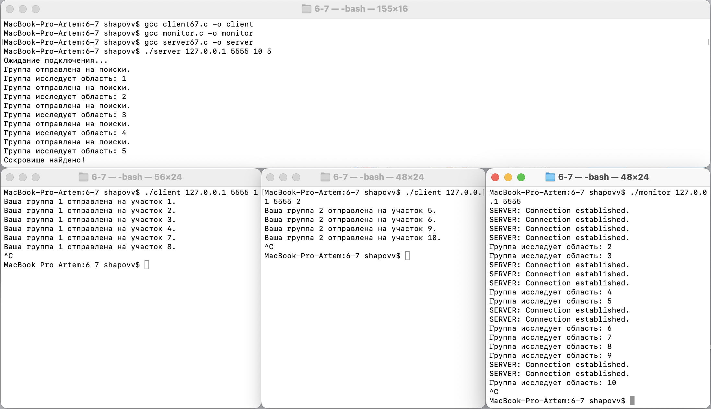

# ИДЗ 4

## Шаповалов Артём Сергеевич | БПИ-217 | Вариант 31

**Задание**

Первая задача об Острове Сокровищ.

Шайка пиратов под предводительством Джона Сильвера высадилась на берег Острова Сокровищ.
Не смотря на добытую карту старого Флинта, местопо- ложение сокровищ по-прежнему остается загадкой,
поэтому искать клад приходится практически на ощупь. Так как Сильвер ходит на деревянной ноге, то
самому бродить по джунглям ему не с руки. Джон Сильвер поделил остров на участки, а
пиратов на небольшие группы. Каждой группе поручается искать клад на одном из участков,
а сам Сильвер ждет на берегу. Пираты, обшарив участок, возвращаются к Сильверу и
докладывают о результатах. Если клад не найден, то пираты назначаются на другой участок.
Требуется создать приложение, моделирующее действия Сильвера и пиратов. Примечание.
Количество участков превы- шает число поисковых групп. Сильвер — сервер. Каждая группа
пиратов является клиентом.

**Решение на 4-5 баллов:**

Разработать клиент–серверное приложение, в котором сервер (или серверы) и клиенты независимо друг от друга отображают только ту информацию, которая поступает им во время обмена. То есть, отсутствует какой-либо общий вывод интегрированной информации, отображающий поведение системы в целом.

Код программ с соответствующими комментариями [server.c](4-5/server.c) и [client.c](4-5/client.c).

Код на 4 балла выполнен в соответствии с требованием: Множество процессов взаимодействуют с использованием именованных
POSIX семафоров. Обмен данными ведется через разделяемую память в стандарте POSIX.

Общий алгоритм:

Программа представляет собой сервер и клиентов, работающих сетевым протоколом UDP, с помощью которых организован поиск клада. Каждый клиент представляет собой группу, ищущую клад, а сервер отвечает за назначение участков для поиска и отслеживание нахождения клада.

Общий алгоритм работы программы следующий:

Сервер:

- Сервер принимает в качестве аргументов IP-адрес, порт, количество участков и номер участка, где спрятан клад.

- Сервер открывает сокет и привязывает его к указанному IP-адресу и порту.

- Сервер начинает ожидание подключений от клиентов.

- Когда клиент подключается, сервер отправляет ему номер участка, который следует проверить.

- Затем сервер ожидает ответа от клиента. Клиент отправляет сообщение о том, что указанный участок был проверен.

- Если отправленный участок был тем, где спрятан клад, сервер вместо номера участка начинает отправлять всем подключающимся клиентам сообщение "TREASURE_FOUND".

- Сервер циклически повторяет вышеуказанные шаги, назначая участки клиентам по одному за раз, начиная с 1 и заканчивая заданным количеством участков. После последнего участка сервер снова возвращает назначение участков к первому.

Клиент:

- Клиент принимает в качестве аргументов имя хоста (сервера), порт и номер группы.

- Клиент открывает сокет и подключается к серверу.

- Клиент читает сообщение от сервера. Если это сообщение "TREASURE_FOUND", клиент печатает сообщение о нахождении клада и завершает свою работу. Если это номер участка, клиент переходит к следующему шагу.

- Клиент печатает сообщение о том, что его группа отправлена на указанный участок.

- Затем клиент отправляет обратно на сервер сообщение о том, что группа проверила указанный участок.

- Клиент закрывает соединение, ждет некоторое время (задержка перед следующей попыткой), а затем снова подключается к серверу и повторяет с шага 3.

Таким образом, сервер координирует работу групп (клиентов), назначая каждой группе участок для проверки и отслеживая обнаружение клада, в то время как клиенты представляют группы, осуществляющие поиск клада, проверяя участки, назначенные сервером, и сообщая о результате проверки.

Ниже приведен набор тестов, покрывающий основную логику программы и результаты тестов:

Компиляция и запуск:

```с
gcc -o server server.c
gcc -o client client.c
./server 127.0.0.1 12345 10 9
```

В других окнах:

```с
./client 127.0.0.1 12345 1
```

```с
./client 127.0.0.1 12345 2
```
И так далее...

Проверка работы:


**Решение на 6-7 баллов:**

Код программ с соответствующими комментариями [6-7/server67.c](6-7/server67.c) и [6-7/client67.c](6-7/client67.c) и [monitor.c](6-7/monitor.c).


В дополнение к программе на предыдущую оценку необходимо разработать клиентскую программу, подключаемую к серверу, которая предназначена для отображение комплексной информации о выполнении приложения в целом. То есть, данный программный модуль должен адекватно отображать поведение моделируемой системы, позволяя не пользоваться отдельными видами, предоставляемыми клиентами и серверами по отдельности.

Здесь представлены три различных приложения - сервер, клиент и монитор - которые вместе моделируют ситуацию поиска клада.

Сервер генерирует номера "участков", где может быть спрятан клад. Каждый клиент при подключении к серверу получает номер участка для поиска клада. Если клад найден (что определяется сравнением номера участка с заранее определенным номером участка с кладом), сервер записывает информацию о найденном кладе в лог-файл и завершает работу. Сервер также записывает в лог-файл информацию о каждом подключении клиента и номере участка, выданного этому клиенту.

Клиенты подключаются к серверу и получают от него номер участка для поиска клада. Затем они "проверяют" участок (в этом примере просто выводят номер участка и номер группы) и отправляют информацию о проверенном участке обратно на сервер. Если сервер уже завершил работу (клад был найден), клиент тоже завершает работу.

Монитор периодически читает лог-файл сервера и выводит его содержимое на экран. Это позволяет наблюдать за ходом работы сервера и клиентов, не взаимодействуя напрямую с каждым из них.

Этот пример демонстрирует общую схему работы многоклиентского сервера и использует UDP сокеты для общения между сервером и клиентами

Компиляция и запуск:

```с
gcc -o server67 server67.c
gcc -o client67 client67.c
gcc -o monitor monitor.c
./server 127.0.0.1 12345 10 9
./monitor 127.0.0.1 12345
```
В других окнах:

```с
./client 127.0.0.1 12345 1
```

```с
./client 127.0.0.1 12345 2
```
И так далее...

Проверка работы:




